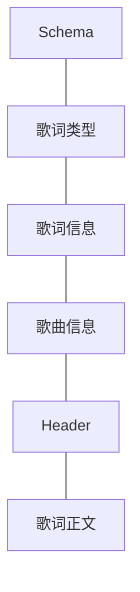

# ALRC (Advanced Lyric)

简体中文 | English (To be done)

## 前言

我们已经有了 [LRC](https://zh.wikipedia.org/wiki/LRC%E6%A0%BC%E5%BC%8F) 格式, 也有其发展出来的一些扩展格式, 但是似乎不足够准确地表现歌曲在某段时间所表现的歌词. 同时还有对 翻译, 音译, 注释的整理, 都是对旧版歌词的一个挑战, 在这里尝试定义一个现代的歌词文件应当如何整理好这些内容.

理念如下:

* 客观地反应听觉效果上的效果
* 解析较为方便
* 不会产生歧义和误解
* 不包含对歌曲内的音效的描述

## 歌词文件

歌词文件由 JSON 进行结构表达

歌词文件包含以下部分:

### 前言说明

* 所有的时间均为从音乐开始时计时

### Schema

ID: `$schema`

Schema 遵循 JSON Schema, 指向当前歌词所使用的 Schema.

Schema 的格式为: `[待定]`

### 歌词信息

ID: `lyricInfo`

Lyric Information 用于存储歌词的相关信息, 可以存在以下字段, 顺序不分先后 (如无注明为非必须)

* `author`: ALRC 歌词制作人
* `translation`: 翻译者
* `timeline`: 时轴者
* `proofread`: 校对
* `offset`: 偏移量, 为当前歌词对于原曲的偏移量. 例如: `-12` 表示歌词需要延后 12 毫秒处理
* `duration`: 时长

### 歌曲信息

字段 ID: `songInfo`

Information 用于存储歌曲的相关信息, 为 Key-value 格式, 例如

对于歌曲: [《Rage Beneath the Mountains》](https://open.spotify.com/track/0PlBjUrb4GKSYhkujRKtzQ), 有如下字段:

* `Name`: `Rage Beneath the Mountains`
* `Artists`: `Yu-Peng Chen, HOYO-MiX` (使用 `, ` 分隔)
* `Album`: `Genshin Impact - The Shimmering Voyage (Original Game Soundtrack)`
* `Lyricist`: `Yu Sun`
* `Composer`: `Yu-Peng Chen`
* `Produced by`: `HOYO-Mix`
* `Orchestrator`: `Jiade He`
* `Band Arranger`: `Dimeng Yuan`
* `BPM`: `136`
* `Language`: `Classical Chinese`
* `Dizi`: `Jiannan Gu`
* ......
 

 > 对显示方建议: 可以使用西文冒号对上述键值对进行拼接,
 > 可将上述信息显示在歌词正文结束后整体显示

 ### Header

字段 ID: `header`

文件头包括 样式 (`styles`)

#### 样式

字段 ID: `styles`
类型: `style[]`

列表字段属性:

* `id`: 样式的 ID, 建议使用 (`歌手简称-自定ID`)
* `position`: 位置, 使用数字 (0 显示端自定, 1 居左, 2 居中, 3 居右), 默认 0 为显示端自定义, 若对于单词执行此项便会影响所在行
* `color`: 颜色 (可选, 采用 Hex Color Code, 不带 `#` 号) [此字段显示端可不解析]
* `type`: 类型, 使用数字 (0 正常, 1 背景音, 2 轻声, 3 加重)
* `hidden`: 是否再未聚焦时隐藏 (`true` 隐藏, `false` 显示)

存在一个默认样式:
`position`: `0`, `type`: `0`, `hidden`: `false`

#### 歌词正文

## 歌词制作

### 打轴

打轴采用小键盘打轴

### 行模式

* `Num_5`: 暂停 / 播放
* `Num_4`: 设置入点
* `Num_6`: 设置出点 (并自动跳转下一行)
* `Num_8`: 跳转上一行
* `Num_2`: 跳转下一行
* `Num_1`: 后退 5 秒
* `Num_3`: 后退 5 秒
* `Num_7`: 
* `Num_9`: 